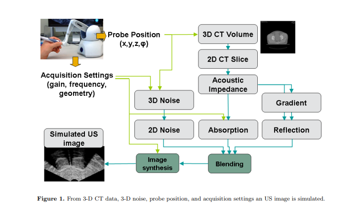
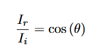
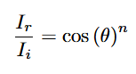
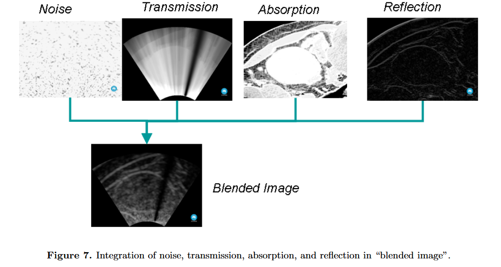

# 1.Ultrasound goes GPU: real-time simulation using CUDA  
#### Paper:  https://campar.in.tum.de/pub/reichl2009spie/reichl2009spie.pdf
#### Code:  NA  

 

## 1. Problems
1. 现有超声模拟方法的计算资源通常受到实时要求的限制。
2. 现存方法有着仿真时间长，极大依赖于采集参数和预先记录的3D数据的质量，包括诸如阴影等伪影的缺点。

 

## 2. Destinations
开发物理上准确的自由手超声实时仿真，包括诸如超声频率、强度、增益等采集参数以及组织特性，并使用GPU加速。

 

## 3. Methods

该仿真框架通过多个阶段处理，首先从3D超声数据中提取2D图像，接着模拟超声波与组织的交互，再添加噪声和模糊，最终生成一个可根据用户需求实时更新的图像。此框架可用于实时的超声图像生成和优化，广泛应用于医学成像和诊断模拟中。

### 3.1 超声图像仿真框架

实现了一个超声图像生成和处理的仿真框架。该框架通过多个阶段的处理过程，从3D超声数据生成逼真的2D超声图像，并模拟超声波与组织的相互作用。

#### 仿真框架的主要步骤

##### 1. **2D重格式化图像的提取**
   - **输入**：给定探头的位置和方向（即探头在空间中的位置和朝向）。
   - **过程**：从三维（3D）超声数据体积中提取一张二维（2D）图像。这个步骤模拟了从3D超声数据“切片”并选择特定视角的图像。

##### 2. **物理现象的模拟**
   - **输入**：包含组织和边界特性的数据。
   - **过程**：模拟超声图像生成过程中涉及的物理现象，主要包括：
     - **反射**：超声波遇到不同组织界面时发生反射，返回探头形成图像。
     - **吸收**：超声波会被组织吸收，影响图像的强度。
     - **传播**：超声波在不同组织中传播，受组织声阻抗（如组织的密度和弹性）影响。
   - 这些物理现象与组织的特性（如声阻抗和朝向）及其与超声波的交互共同决定了最终图像的效果。

##### 3. **斑点噪声和模糊的添加**
   - **输入**：基础的超声图像。
   - **过程**：在生成的图像中添加斑点噪声和模糊：
     - **斑点噪声**：超声图像常见的噪声类型，通常由超声波与组织不均匀相互作用产生。
     - **模糊**：由探头的运动、组织复杂性或图像分辨率限制等因素引起。
   - 通过这些后处理步骤，使图像更加逼真，模拟现实中超声图像的噪声和模糊效果。

##### 4. **实时更新**
   - **输入**：用户定义的参数。
   - **过程**：生成的图像可以根据用户输入的参数进行实时更新。例如，探头位置的变化、图像分辨率的调整，或其他超声设备的设置都会影响最终的图像。

### 3.2 Reflection 反射
两种反射：镜面反射 漫反射

#### 镜面反射：

#### 漫反射：
  
***US图像更关注漫反射***

#### 混合反射：p
  
***真实的超声图像中，既存在漫反射，也可能存在镜面反射，论文给出一种组合模型***  
   - **参数n**：
      - 当 n = 1 时，仅考虑漫反射
      - 当 n > 1 时，加入镜面反射的成分，一般选择 n = 2,因为与反射相关的不均匀度超过超出了腹部CT图像通常的分辨率，选n = 2简化运算

 

#### ***超声仿真中的反射强度估算***

在超声仿真中，反射强度可以通过以下公式估算：

$$
\frac{I_r(x)}{I_i(x)} \approx \cos^2(\theta) \left( \frac{\|\nabla Z(x)\|}{2 \cdot Z(x)} \right)^2 = \left( d^T \cdot \frac{\nabla Z(x)}{\|\nabla Z(x)\|} \right)^2 \left( \frac{\|\nabla Z(x)\|}{2 \cdot Z(x)} \right)^2 = \left( \frac{d^T \cdot \nabla Z(x)}{2 \cdot Z(x)} \right)^2
$$

#### 公式说明

1. **变量定义**:
   - $$\(I_r(x)\)$$: 在位置 \(x\) 的反射强度。
   - $$\(I_i(x)\)$$: 在位置 \(x\) 的入射强度。
   - $$\(\nabla Z(x)\)$$: 声阻抗 \(Z(x)\) 的梯度，表示声阻抗在空间中的变化速率。
   - $$\(\|\nabla Z(x)\|\)$$: 声阻抗梯度的模长，表示变化的强度。
   - $$\(d\)$$: 入射波方向的单位向量。
   - $$\(Z(x)\)$$: 位置 \(x\) 的声阻抗。
   - $$\(\cos^2(\theta)\)$$: 入射波方向与界面法线夹角的余弦平方。

2. **公式关键部分**:
   - **方向影响**:
     $$d^T \cdot \frac{\nabla Z(x)}{\|\nabla Z(x)\|}$$:
     该部分表示入射波方向 \(d\) 和声阻抗梯度方向的关系。当入射方向与梯度方向越对齐时，反射强度越高。

   - **梯度强度**:
     $$\|\nabla Z(x)\|$$:
     反映声阻抗变化的强度，例如在组织交界处，变化越剧烈，反射强度越高。

   - **归一化梯度**:
     $$\frac{\|\nabla Z(x)\|}{2 \cdot Z(x)}$$:
     将声阻抗梯度按局部声阻抗归一化，用于平衡局部变化和基准阻抗的影响。

3. **最终强度**:
   综合上述因素，计算反射强度的最终公式为：
   $$\frac{I_r(x)}{I_i(x)} \approx \left( \frac{d^T \cdot \nabla Z(x)}{2 \cdot Z(x)} \right)^2$$
   该公式结合了方向对齐、梯度强度以及归一化效果，用于估算反射强度。

 

### 3.3 Absorption 吸收

  
*归一化后*  

将超声阻抗映射到超声吸收中，利用插值法，选取两个区间，在空气和水，水和骨头这两个区间创建二次函数，进行二次插值，就可以有效创建声阻抗到声吸收的模型，将两个参数关联起来。

 

### 3.4 Transmission 传播
  
*blending image*  
  
Explanation：平方项表示从prob发射的US到反射体的传播过程中衰减和吸收效果和反射回prob的效果的叠加

 

### 3.5 Speckle noise and blurring 斑点噪音和模糊

#### 1. 散斑噪声的建模：
      

